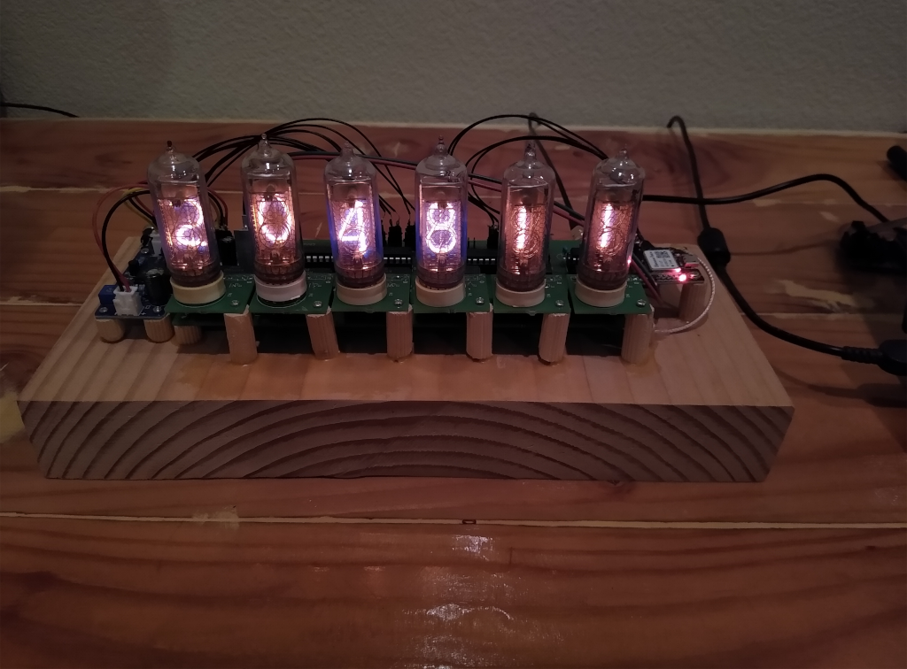
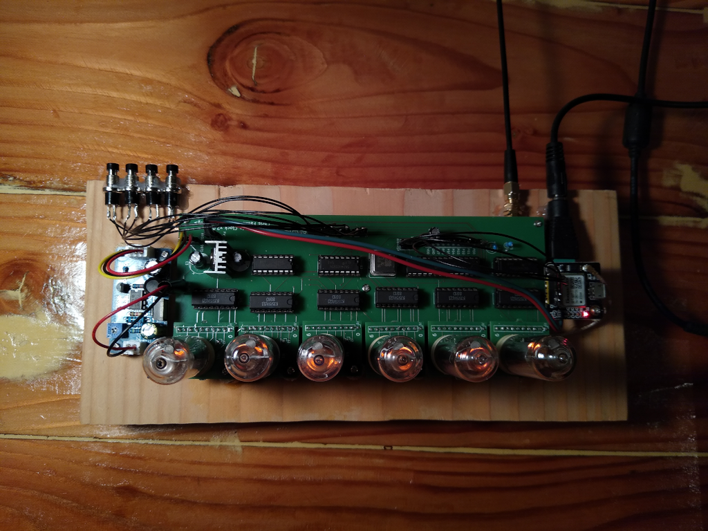

# GPS-synchronized Nixie tube clock

This is a custom-designed (custom circuit design / PCB boards and custom
microcontroller firmware) digital clock. It receives the time from a GPS
receiver board, adjusts for an user-selectable timezone, and displays the time
on "Nixie tubes". A [nixie tube](https://en.wikipedia.org/wiki/Nixie_tube) is a
cold-cathode vacuum tube display technology: it uses high voltage (about 160
volts in this design) applied to an electrode in the shape of a digit in order
to display a number in brilliant glowing orange. It really is quite
mesmerizing!

This repo contains custom circuit board layouts for the main clock board and a
separate adapter sub-board for each Nixie tube. The sub-boards are designed for
IN-14 tubes (which can currently be found on eBay or Etsy for ~$20 each), but
could be adapted for IN-12, IN-18, or some other size.

The main board contains an AVR ATmega8 microcontroller, a 20MHz crystal,
several 74HC595 shift registers to expand the AVR's IO, and six KI155ID1
open-collector high voltage driver chips.

The board interfaces with a separate high-voltage DC-DC power supply, because
designing such a supply to be efficient is quite hard and I do not possess the
analog black magic skills! I bought [this
one](https://www.amazon.com/gp/product/B09D94N3MX) for $11. You can substitute
any suitable source of ~160V DC rated for about 4mA per tube (24mA total, or
just under 4 watts).

GPS is also black magic, so I bought a pre-designed GPS receiver module
[here](https://www.amazon.com/gp/product/B07P8YMVNT) for $12, and an external
active antenna [here](https://www.amazon.com/gp/product/B083D59N55) for $11.
The module provides a 1Hz "pulse-per-second" precision output and a 9600bps
serial line providing time, position, and satellite lock information using the
[NMEA](https://en.wikipedia.org/wiki/NMEA_0183) protocol. You can substitute
any GPS receiver that provides a PPS output and NMEA signal.

The ATmega8 runs firmware that decodes the NMEA to get an initial time
(synchronizing whenever a valid NMEA packet with a timestamp is received). It
measures the internal crystal oscillator against the PPS and then ticks based
on the main CPU clock, calibrated with this ticks-per-PPS value. This allows
the clock to receive the time when GPS signal is available, learn how fast or
slow its own internal oscillator is running, and then continue to keep time
when the GPS signal is lost. Whenever it comes back, time will resynchronize
automatically.

There is a simple user interface consisting of four buttons. The leftmost (SW4
on the main board) switches between time mode and set-timezone mode. In the
latter, SW2 decrements TZ offset hour and SW1 increments TZ offset hour.
(Half-hour or 15 minute timezone offsets are not yet supported; I know these
timezones exist, sorry! Happy to take PRs if anyone in such a timezone builds
this clock!)

Total cost for the clock, not including the one-time tool purchases I made
(e.g. an AVR programmer) or the scrap wood, glue, etc. for the very janky base,
and definitely not including my time, was about $230:

- $42 for the PCBs (mainboard and 6x nixie tube adapters) at Aisler.net
- $90 for the six IN-14s, on Etsy
- $22 for the KI155ID1 driver chips
- $12 for the GPS receiver
- $11 for the GPS antenna
- $11 for the 160V DC supply
- about $40 for the ATmega8, 20MHz crystal, 74HC595s, a few resistors and
  capacitors, pin headers, wire, etc.

I started thinking about building a Nixie clock in 2014, but started working on
this design regularly in Nov 2021. It first displayed a GPS-synchronized time
on Jan 6, 2022. I'd like to improve the UI a bit (allow a non-GPS
locally-set-time mode as well), and definitely improve the casing, but it suits
me well enough for now! I finally know what time it is!
